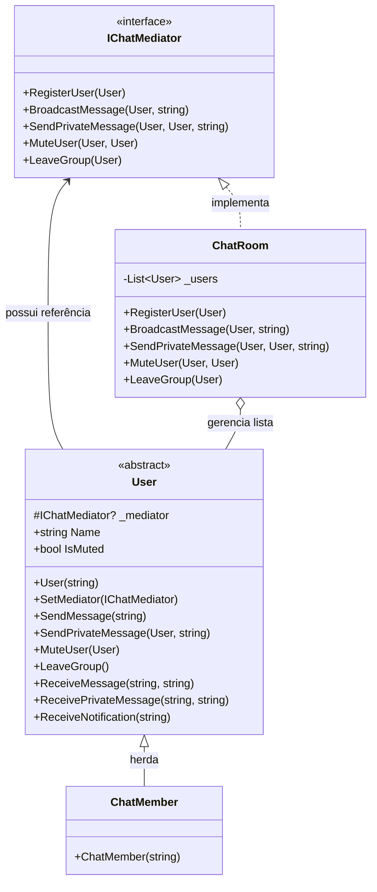

## 🥁 CarnaCode 2026 - Desafio 17 - Mediator

Oi, eu sou o Ronaldo e este é o espaço onde compartilho minha jornada de aprendizado durante o desafio **CarnaCode 2026**, realizado pelo [balta.io](https://balta.io). 👻

Aqui você vai encontrar projetos, exercícios e códigos que estou desenvolvendo durante o desafio. O objetivo é colocar a mão na massa, testar ideias e registrar minha evolução no mundo da tecnologia.

### Sobre este desafio
No desafio **Mediator** eu tive que resolver um problema real implementando o **Design Pattern** em questão.
Neste processo eu aprendi:
* ✅ Boas Práticas de Software
* ✅ Código Limpo
* ✅ SOLID
* ✅ Design Patterns (Padrões de Projeto)

## Problema
Um aplicativo de mensagens tem usuários que precisam enviar mensagens para grupos, notificar quando entram/saem, e gerenciar permissões.
O código atual faz cada usuário conhecer e se comunicar diretamente com todos os outros, criando acoplamento complexo.

## Sobre o CarnaCode 2026
O desafio **CarnaCode 2026** consiste em implementar todos os 23 padrões de projeto (Design Patterns) em cenários reais. Durante os 23 desafios desta jornada, os participantes são submetidos ao aprendizado e prática na idetinficação de códigos não escaláveis e na solução de problemas utilizando padrões de mercado.

### eBook - Fundamentos dos Design Patterns
Minha principal fonte de conhecimento durante o desafio foi o eBook gratuito [Fundamentos dos Design Patterns](https://lp.balta.io/ebook-fundamentos-design-patterns).

### Veja meu progresso no desafio
[Repositório central](https://github.com/ronaldofas/balta-desafio-carnacode-2026-central)

---

## 🛠️ Refatoração com o Padrão Mediator

Para solucionar o problema de alta dependência e comunicação caótica (M×N) entre os usuários do chat, foi aplicado o padrão de projeto comportamental **Mediator**.

### Sobre o Padrão Mediator
O **Mediator** é um padrão que define um objeto central que encapsula a forma como um conjunto de objetos interage. Ele promove o baixo acoplamento ao evitar que os objetos (neste caso, os *usuários*) se refiram uns aos outros explicitamente. Agora, em vez dos usuários mandarem mensagens diretamente uns para os outros em um loop, eles repassam a intenção para o Mediator (a *Sala de Chat*), e o mediador cuida de rotear o aviso ou mensagem aos destinatários e validar regras (como a de moderação).

### Etapas da Refatoração
A refatoração ocorreu de forma iterativa seguindo as etapas:
1. **Configuração do Projeto**: Criação do arquivo `src/MediatorPattern.csproj` (Target .NET 10).
2. **Definição das Abstrações**:
   - Criação da interface `IChatMediator.cs` descrevendo as ações disponíveis na sala.
   - Criação da classe base abstrata `User.cs` (*Colleague*).
3. **Implementações Concretas**:
   - Criação de `ChatRoom.cs`, materializando as regras de uso interno listadas no mediador (como entrar ou sair da sala, falar ou ser mutado de modo centralizado).
   - Criação do `ChatMember.cs`, o usuário em si, encarregado apenas de mandar/receber dados do/para o mediador, garantindo o "Princípio de Responsabilidade Única".
4. **Validação (Ponto de Entrada)**: Criação de um novo `Program.cs` que permite rodar de forma visual no terminal o sistema antigo problemático Vs o sistema após implementação do *Mediator* de forma comparativa.

### Estrutura de Arquivos

```text
📦 balta-desafio-carnacode-2026_17-mediator
 ┣ 📂 src
 ┃ ┣ 📜 Challenge.cs          # Código original apresentando os problemas de acoplamento
 ┃ ┣ 📜 ChatMember.cs         # Implementação concreta do Usuário (Colleague)
 ┃ ┣ 📜 ChatRoom.cs           # Implementação concreta do Mediador de Chat (Mediator)
 ┃ ┣ 📜 IChatMediator.cs      # Interface do Mediador com contratos de comunicação
 ┃ ┣ 📜 MediatorPattern.csproj# Arquivo do projeto C# (Target .NET 10)
 ┃ ┣ 📜 Program.cs            # Ponto de entrada atual principal
 ┃ ┗ 📜 User.cs               # Classe abstrata base para os usuários
 ┣ 📜 README.md               # Esta documentação
```

### Diagrama de Classes (Implementação do Mediator)


